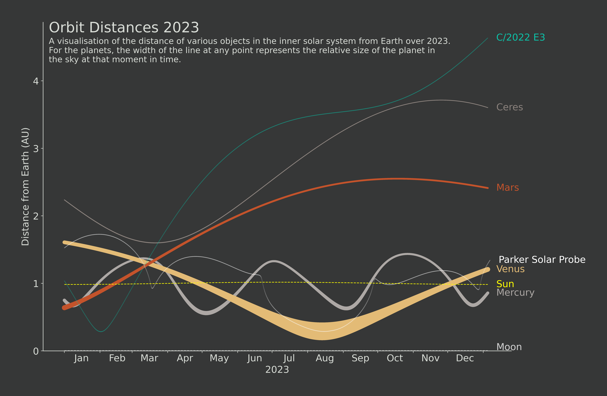

# Orbits

Some experiments using data from the [NASA Horizons API](https://ssd-api.jpl.nasa.gov/doc/horizons.html)

## Orbit Distance Visualisations

The following two visualisations use the distance and angular size of various objects in the
solar system over 2023. 

